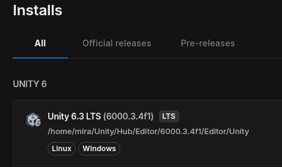
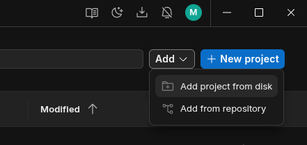

# Plat Up: Light & Dark
Special for DES Winter School 2026

# Team Staff
**Myroslav *"MiraDiv"* Terokhin** - Team Leader, plot and idea author; 
**Ilya *"Relax"* Negusev** - Head Programmer; 
**Ivan *"BiBy_BoX"* Potopalskiy** - Mechanics and narrative design; 
**Daria Gryshchenko** - Sprite and art design. 

# For contributors
First of all, download Unity Hub and download **EXACTLY the <ins>6000.3.4f1** version of engine. Make sure you enabled "Windows Build Support (Mono)" module before downloading the rest of engine, to not lose the time.

After you done, follow the next instructions:

1. Clone the repository:
~~~bash
git clone https://github.com/MiraDiv-git/winterschool2026
~~~

2. Open Unity Hub, register or log in in a prefered way
3. Press at "Add" button and select "Add project from disk" in the dropdown:

4. In the selection windows select the directory where you cloned repository
5. Enter the project
> [!NOTE]
First launch may take a while, as Unity should download basic libraries. That's why project's repository looks 'that small'. Trust me there's everything you need